  

I'm a final-year B.Tech CSE (AI & ML) student at UPES, Dehradun, graduating in 2027. I build web and desktop software end to end, and I spend the rest of my time finding out how AI systems fail.

[Portfolio](https://somansh.in) · [LinkedIn](https://linkedin.com/in/somansh1) · [somansh@somansh.in](mailto:somansh@somansh.in)

## Shipped

| Project | What it is | Built with |
|---|---|---|
| **[ChatLens](https://chat-lens-ivory.vercel.app/?demo)** | Chat analytics that never leaves your browser. Parses WhatsApp, Instagram and Messenger exports and charts who texts more, when, and what. A Content-Security-Policy blocks every outgoing request, so the privacy claim is enforced, not promised. [Source](https://github.com/Somansh1/ChatLens) | Next.js, TypeScript, hand-written SVG charts |
| **[SocialSpace](https://github.com/Somansh1/socialspace)** | A table for two. Chat, peer-to-peer calls, a shared canvas and watch-together between two people, over a small WebSocket relay and WebRTC. | Next.js, WebSocket, WebRTC, Node.js |
| **[Gem-VTuber](https://github.com/Somansh1/gem-companion-vtuber)** | A desktop companion. A transparent always-on-top window renders a Live2D avatar that talks through the Gemini Live API; the model's tool calls drive its expressions and its lips follow the audio. | Electron, PixiJS, Live2D, WebSocket |
| **[SRE Autopilot](https://github.com/Somansh1/sre_env)** | An RL-style environment for incident response. Seven microservices in a dependency graph, a hidden root cause, noisy telemetry, and an SLA-based reward for whichever agent is on call. | Python, FastAPI, OpenEnv, Docker |
| **[AppD-Lite-Net](https://github.com/Somansh1/cnn-backend)** | Apple leaf disease detection with a CNN under one million parameters: 99.53% on a held-out test set and 98.80% in 5-fold cross-validation. Co-first author of the manuscript. [Frontend](https://github.com/Somansh1/cnn-frontend) | TensorFlow/Keras, FastAPI, React |
| **[Fouress Bath](https://fouressbath.com)** | The live catalogue site for a plumbing and sanitaryware retailer, with structured data and technical SEO done properly. | Next.js, Tailwind CSS |

## Experience

**AI/ML & Software Engineering Intern, Bharat Electronics Limited** · Jun to Aug 2025

- Built a FAISS-backed retrieval pipeline on Llama 3.2 Vision over 100+ page internal documents, taking lookups for 50+ staff from hours to under 10 seconds.
- Scripted RHEL 9 environment setup, cutting per-machine provisioning from 3 hours to 15 minutes.
- Shipped a one-click installer so non-technical staff could set the system up on-prem.

**Secretary, IEEE Computer Society (UPES)** · Mar 2026 to present

## Security research

- **Red-team audit of a production AI assistant (2025).** Recovered the assistant's full system prompt through a chain of persona jailbreak, metadata probing and chunked extraction, then reported five findings to the vendor with a proposed hardened prompt design.
- **Prompt-extraction comparison across six consumer assistants (2025).** Ran one family of extraction prompts against Gemini, ChatGPT, Grok, Perplexity, Meta AI and Claude: three returned instruction-like text, two refused, one returned nothing.

## Toolbox

**Languages** Python · TypeScript / JavaScript · Java · C / C++ · SQL 
**Web** React · Next.js · Tailwind CSS · Node.js · WebSocket · WebRTC 
**AI / ML** RAG pipelines · FAISS · LLM fine-tuning · PyTorch · TensorFlow · scikit-learn 
**Systems** Linux (RHEL) · Docker · Bash · Electron · Git

## Away from the keyboard

Astrophotography, regular photography, and games.
