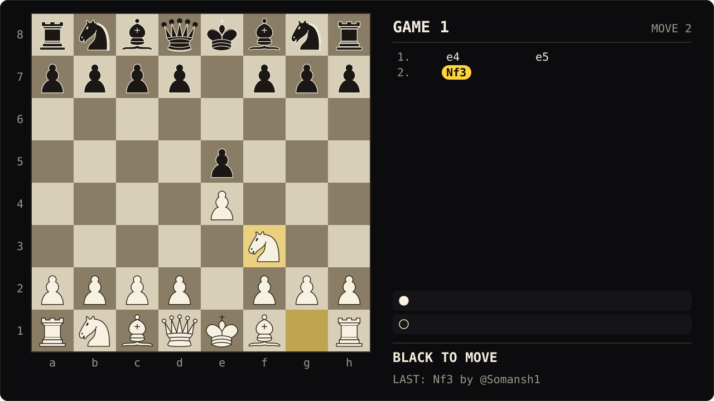

  

  

  &nbsp;&nbsp;
  &nbsp;&nbsp;
  

  <picture>
    <source media="(prefers-color-scheme: dark)" srcset="./assets/heading-commits-dark.svg">
    
  </picture>

  

  <picture>
    <source media="(prefers-color-scheme: dark)" srcset="./assets/heading-catalogue-dark.svg">
    
  </picture>

  
  

  
  

  
  

Catalogue as text

| Project | What it is | Built with |
|---|---|---|
| **[ChatLens](https://chatlens.somansh.in/?demo)** | Chat analytics that never leaves your browser. Parses WhatsApp, Instagram and Messenger exports and charts who texts more, when, and what. A Content-Security-Policy blocks every outgoing request, so the privacy claim is enforced, not promised. [Source](https://github.com/Somansh1/ChatLens) | Next.js, TypeScript, hand-written SVG charts |
| **[SocialSpace](https://socialspace.somansh.in)** | A table for two. Chat, peer-to-peer calls, a shared canvas and watch-together between two people, over a small WebSocket relay and WebRTC. [Source](https://github.com/Somansh1/socialspace) | Next.js, WebSocket, WebRTC, Node.js |
| **[Gem-VTuber](https://github.com/Somansh1/gemvtuber)** | A desktop companion. A transparent always-on-top window renders a Live2D avatar that talks through the Gemini Live API; the model's tool calls drive its expressions and its lips follow the audio. | Electron, PixiJS, Live2D, WebSocket |
| **[SRE Autopilot](https://github.com/Somansh1/SRE-RL-Env)** | An RL-style environment for incident response. Seven microservices in a dependency graph, a hidden root cause, noisy telemetry, and an SLA-based reward for whichever agent is on call. | Python, FastAPI, OpenEnv, Docker |
| **[AppD-Lite-Net](https://github.com/Somansh1/cnn-backend)** | Apple leaf disease detection with a CNN under one million parameters: 99.53% on a held-out test set and 98.80% in 5-fold cross-validation. Co-first author of the manuscript. [Frontend](https://github.com/Somansh1/cnn-frontend) | TensorFlow/Keras, FastAPI, React |
| **[Fouress Bath](https://fouressbath.com)** | The live catalogue site for a plumbing and sanitaryware retailer, with structured data and technical SEO done properly. | Next.js, Tailwind CSS |

  

Security research as text

- **Red-team audit of a production AI assistant (2025).** Recovered the assistant's full system prompt through a chain of persona jailbreak, metadata probing and chunked extraction, then reported five findings to the vendor with a proposed hardened prompt design.
- **Prompt-extraction comparison across six consumer assistants (2025).** Ran one family of extraction prompts against Gemini, ChatGPT, Grok, Perplexity, Meta AI and Claude: three returned instruction-like text, two refused, one returned nothing.

  <picture>
    <source media="(prefers-color-scheme: dark)" srcset="./assets/heading-logbook-dark.svg">
    
  </picture>

  

Experience as text

**AI/ML & Software Engineering Intern, Bharat Electronics Limited** · Jun to Aug 2025

- Built a FAISS-backed retrieval pipeline on Llama 3.2 Vision over 100+ page internal documents, taking lookups for 50+ staff from hours to under 10 seconds.
- Scripted RHEL 9 environment setup, cutting per-machine provisioning from 3 hours to 15 minutes.
- Shipped a one-click installer so non-technical staff could set the system up on-prem.

**Secretary, IEEE Computer Society (UPES)** · Mar 2026 to present

<!-- chess:start -->

<picture><source media="(prefers-color-scheme: dark)" srcset="./assets/heading-your-move-dark.svg"></picture>

  
     
      
   
    
               

Moves as text

Legal moves for black (29):

- Pawn a7: [a5](https://github.com/Somansh1/Somansh1/issues/new?title=chess%7Cmove%7Ca7a5%7C1&body=Just+press+%22Create%22.+The+board+updates+in+about+a+minute.) [a6](https://github.com/Somansh1/Somansh1/issues/new?title=chess%7Cmove%7Ca7a6%7C1&body=Just+press+%22Create%22.+The+board+updates+in+about+a+minute.)
- Pawn b7: [b5](https://github.com/Somansh1/Somansh1/issues/new?title=chess%7Cmove%7Cb7b5%7C1&body=Just+press+%22Create%22.+The+board+updates+in+about+a+minute.) [b6](https://github.com/Somansh1/Somansh1/issues/new?title=chess%7Cmove%7Cb7b6%7C1&body=Just+press+%22Create%22.+The+board+updates+in+about+a+minute.)
- Pawn c7: [c5](https://github.com/Somansh1/Somansh1/issues/new?title=chess%7Cmove%7Cc7c5%7C1&body=Just+press+%22Create%22.+The+board+updates+in+about+a+minute.) [c6](https://github.com/Somansh1/Somansh1/issues/new?title=chess%7Cmove%7Cc7c6%7C1&body=Just+press+%22Create%22.+The+board+updates+in+about+a+minute.)
- Pawn d7: [d5](https://github.com/Somansh1/Somansh1/issues/new?title=chess%7Cmove%7Cd7d5%7C1&body=Just+press+%22Create%22.+The+board+updates+in+about+a+minute.) [d6](https://github.com/Somansh1/Somansh1/issues/new?title=chess%7Cmove%7Cd7d6%7C1&body=Just+press+%22Create%22.+The+board+updates+in+about+a+minute.)
- Pawn f7: [f5](https://github.com/Somansh1/Somansh1/issues/new?title=chess%7Cmove%7Cf7f5%7C1&body=Just+press+%22Create%22.+The+board+updates+in+about+a+minute.) [f6](https://github.com/Somansh1/Somansh1/issues/new?title=chess%7Cmove%7Cf7f6%7C1&body=Just+press+%22Create%22.+The+board+updates+in+about+a+minute.)
- Pawn g7: [g5](https://github.com/Somansh1/Somansh1/issues/new?title=chess%7Cmove%7Cg7g5%7C1&body=Just+press+%22Create%22.+The+board+updates+in+about+a+minute.) [g6](https://github.com/Somansh1/Somansh1/issues/new?title=chess%7Cmove%7Cg7g6%7C1&body=Just+press+%22Create%22.+The+board+updates+in+about+a+minute.)
- Pawn h7: [h5](https://github.com/Somansh1/Somansh1/issues/new?title=chess%7Cmove%7Ch7h5%7C1&body=Just+press+%22Create%22.+The+board+updates+in+about+a+minute.) [h6](https://github.com/Somansh1/Somansh1/issues/new?title=chess%7Cmove%7Ch7h6%7C1&body=Just+press+%22Create%22.+The+board+updates+in+about+a+minute.)
- Knight b8: [Na6](https://github.com/Somansh1/Somansh1/issues/new?title=chess%7Cmove%7Cb8a6%7C1&body=Just+press+%22Create%22.+The+board+updates+in+about+a+minute.) [Nc6](https://github.com/Somansh1/Somansh1/issues/new?title=chess%7Cmove%7Cb8c6%7C1&body=Just+press+%22Create%22.+The+board+updates+in+about+a+minute.)
- Knight g8: [Ne7](https://github.com/Somansh1/Somansh1/issues/new?title=chess%7Cmove%7Cg8e7%7C1&body=Just+press+%22Create%22.+The+board+updates+in+about+a+minute.) [Nf6](https://github.com/Somansh1/Somansh1/issues/new?title=chess%7Cmove%7Cg8f6%7C1&body=Just+press+%22Create%22.+The+board+updates+in+about+a+minute.) [Nh6](https://github.com/Somansh1/Somansh1/issues/new?title=chess%7Cmove%7Cg8h6%7C1&body=Just+press+%22Create%22.+The+board+updates+in+about+a+minute.)
- Bishop f8: [Ba3](https://github.com/Somansh1/Somansh1/issues/new?title=chess%7Cmove%7Cf8a3%7C1&body=Just+press+%22Create%22.+The+board+updates+in+about+a+minute.) [Bb4](https://github.com/Somansh1/Somansh1/issues/new?title=chess%7Cmove%7Cf8b4%7C1&body=Just+press+%22Create%22.+The+board+updates+in+about+a+minute.) [Bc5](https://github.com/Somansh1/Somansh1/issues/new?title=chess%7Cmove%7Cf8c5%7C1&body=Just+press+%22Create%22.+The+board+updates+in+about+a+minute.) [Bd6](https://github.com/Somansh1/Somansh1/issues/new?title=chess%7Cmove%7Cf8d6%7C1&body=Just+press+%22Create%22.+The+board+updates+in+about+a+minute.) [Be7](https://github.com/Somansh1/Somansh1/issues/new?title=chess%7Cmove%7Cf8e7%7C1&body=Just+press+%22Create%22.+The+board+updates+in+about+a+minute.)
- Queen d8: [Qe7](https://github.com/Somansh1/Somansh1/issues/new?title=chess%7Cmove%7Cd8e7%7C1&body=Just+press+%22Create%22.+The+board+updates+in+about+a+minute.) [Qf6](https://github.com/Somansh1/Somansh1/issues/new?title=chess%7Cmove%7Cd8f6%7C1&body=Just+press+%22Create%22.+The+board+updates+in+about+a+minute.) [Qg5](https://github.com/Somansh1/Somansh1/issues/new?title=chess%7Cmove%7Cd8g5%7C1&body=Just+press+%22Create%22.+The+board+updates+in+about+a+minute.) [Qh4](https://github.com/Somansh1/Somansh1/issues/new?title=chess%7Cmove%7Cd8h4%7C1&body=Just+press+%22Create%22.+The+board+updates+in+about+a+minute.)
- King e8: [Ke7](https://github.com/Somansh1/Somansh1/issues/new?title=chess%7Cmove%7Ce8e7%7C1&body=Just+press+%22Create%22.+The+board+updates+in+about+a+minute.)

Recent moves:

- 1. e4 by @Somansh1
- 1... e5 by @Somansh1
- 2. Nf3 by @Somansh1

<!-- chess:end -->

  <picture>
    <source media="(prefers-color-scheme: dark)" srcset="./assets/heading-instruments-dark.svg">
    
  </picture>

  

Toolbox as text

**Languages** Python · TypeScript / JavaScript · Java · C / C++ · SQL 
**Web** React · Next.js · Tailwind CSS · Node.js · WebSocket · WebRTC 
**AI / ML** RAG pipelines · FAISS · LLM fine-tuning · PyTorch · TensorFlow · scikit-learn 
**Systems** Linux (RHEL) · Docker · Bash · Electron · Git

  <picture>
    <source media="(prefers-color-scheme: dark)" srcset="./assets/colophon-dark.svg">
    
  </picture>

